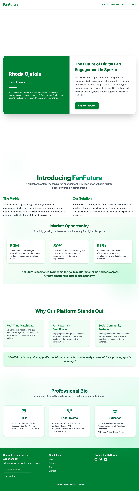

# AltSchool of Engineering Tinyuka Second Semester Project Submission (Cloud) (Digital Fan Engagement Web Deployment)

This project demonstrates how to deploy a dynamic React website on a cloud server using Nginx. The website, built with Vite, Tailwind CSS, and EmailJS, showcases a prototype titled **"The Future of Digital Fan Engagement in Sports."**

It includes server provisioning, file transfer via Termius and SCP, Nginx configuration, domain DNS setup with FreeDNS, and HTTPS configuration using Let's Encrypt.

## Project Structure

* React app initialized with Vite
* Tailwind CSS for styling
* EmailJS for contact form integration

---

## 1. Development Setup

### Tools Used

* **React** (via Vite)
* **Tailwind CSS**
* **EmailJS** for sending contact form emails

### Run Locally

```bash
npm install
npm run dev
```

Build for production:

```bash
npm run build
```

This generates a `dist` folder for deployment.


---

## 2. Cloud Server Setup

### Server Provider

* AWS EC2 (Ubuntu 22.04 LTS)

### SSH Access

* Connected via **Termius Desktop** using private key authentication

### File Transfer

* Used `scp` command for secure file transfer on my local terminal:

```bash
scp -i ~/Downloads/first-project.pem -r  ./dist ubuntu@<ipaddress>:/home/ubuntu/
```


---

## 3. Nginx Installation & Configuration

### Install Nginx

```bash
sudo apt update
sudo apt install nginx -y
```

### Start & Enable Nginx

```bash
sudo systemctl start nginx
sudo systemctl enable nginx
```

### Serve React App with Nginx

Then moved the files into Nginx’s serving directory:

```bash
sudo mv dist /var/www/html/
sudo mv /var/www/html/dist/* /var/www/html/
sudo rm -r /var/www/html/dist
```


Check and Edit default Nginx config:

```bash
sudo nano /etc/nginx/sites-available/default
```

Check config and reload:

```bash
sudo nginx -t
sudo systemctl reload nginx
```

---

## 4. Domain Setup (FreeDNS)

Used [https://freedns.afraid.org](https://freedns.afraid.org) to create a free subdomain:

```
fanfuture.mooo.com
```

### Record Type:

* A Record (points directly to server IP)

DNS was tested using:

```bash
ping fanfuture.mooo.com
```

---

## 5. HTTPS Setup (Let’s Encrypt SSL)

Installed Certbot:

```bash
sudo apt install certbot python3-certbot-nginx -y
```

Requested certificate:

```bash
sudo certbot --nginx -d fanfuture.mooo.com
```
Check and Edit default Nginx config:

```bash
sudo nano /etc/nginx/sites-available/default
```
The block looks like this:

```nginx
# HTTP Server Block
server {
    listen 80;
    listen [::]:80;
    server_name fanfuture.mooo.com;

    # Redirect all HTTP to HTTPS
    return 301 https://$host$request_uri;
}

# HTTPS Server Block
server {
    listen 443 ssl;
    listen [::]:443 ssl;
    server_name fanfuture.mooo.com;

    root /var/www/html;
    index index.html;

    # SSL certificates from Let's Encrypt
    ssl_certificate /etc/letsencrypt/live/fanfuture.mooo.com/fullchain.pem;
    ssl_certificate_key /etc/letsencrypt/live/fanfuture.mooo.com/privkey.pem;
    include /etc/letsencrypt/options-ssl-nginx.conf;
    ssl_dhparam /etc/letsencrypt/ssl-dhparams.pem;

    location / {
        try_files $uri /index.html;
    }

}
```

Test HTTPS:

```
https://fanfuture.mooo.com
```

---

## 6. Final Result

The live site is now hosted at:
[Fanfuture](https://fanfuture.mooo.com)

```
https://fanfuture.mooo.com
```




---


## Author

**Rhoda**
Cloud Engineering Student, AltSchool Africa
